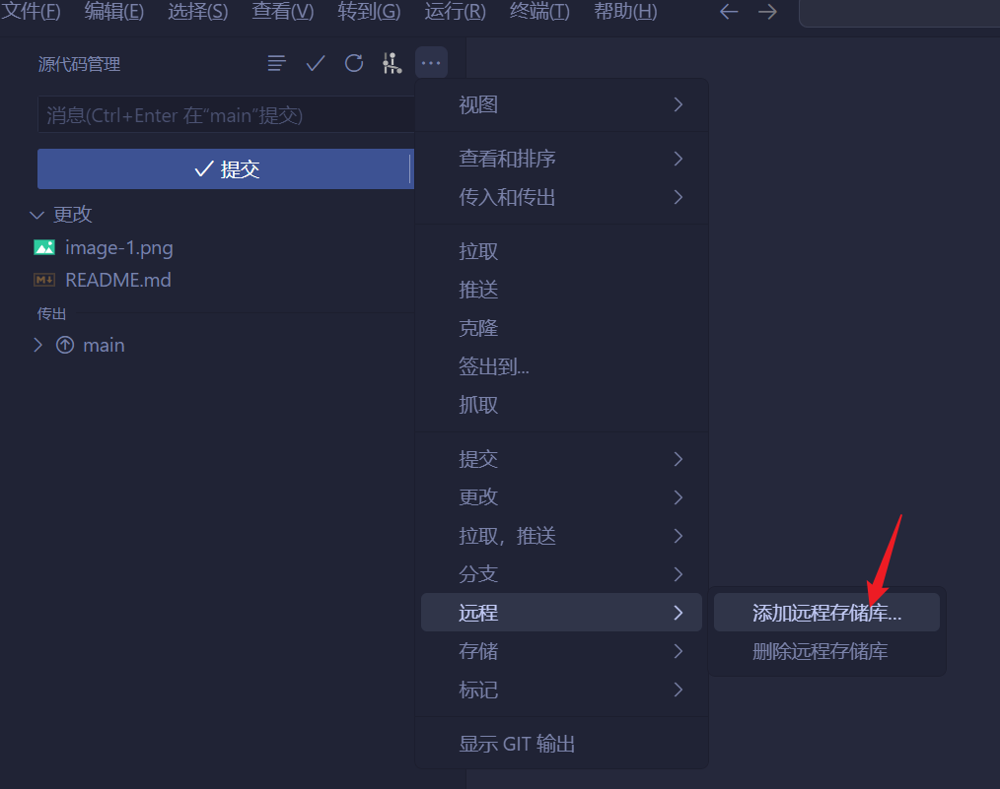

# filio-vue
https://github.com/sjtuli/filio-vue

[Live Demo](https://www.ayushsingh.co.in)

The origin program is [here](https://github.com/ayush013/folio.git), which is powered by React. And I have got to praise the project's owner for his great work. What he had done presents a wonderful UI/UX.

This one is based on nuxt3(vue3) + vite + unocss + sass + viewport adapt + axios

> 基于 nuxt3(Vue3) + unocss + sass + viewport 适配方案 + axios 封装.

自用

# nuxt3 打包部署（generate方式）
## 1、把项目打包
 > npm run generate
## 2、新建github仓库，并把代码上传到github上
填入仓库地址，例如：https://github.com/zikcc/resGro.git，后回车，然后vscode会让对此远程仓库起个别称，输入起别称就可以。
